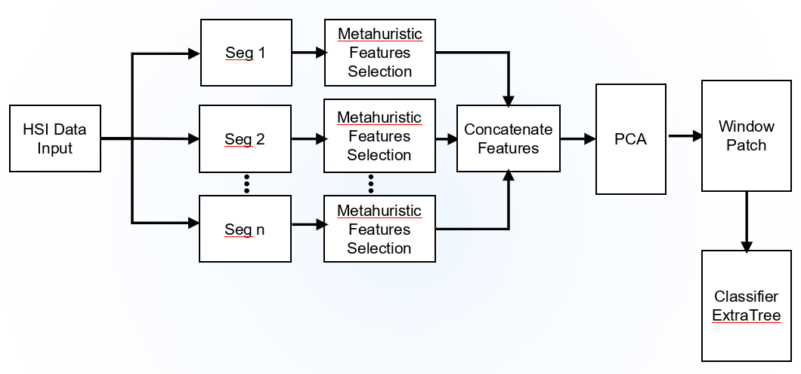
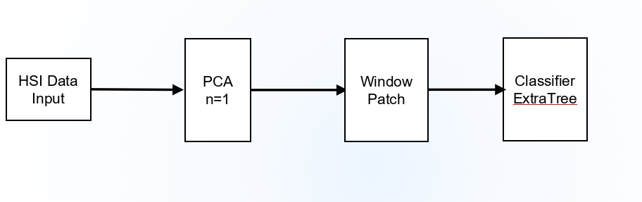

# Methodology 1

### config
- Test ratio = 0.7
- Window size = 25
- PCA components = 1
- KFold = 5

 
### Results — IP (Metaheuristic + ExtraTrees)

| Metaheuristic | Classifier | OA (%) | AA (%) | Kappa | CV OA (%) | Train Time (s) | Test Time (s) |
|---------------|------------|--------|--------|-------|-----------|----------------|---------------|
| PSO           | ExtraTrees | 99.02  | 96.82  | 0.9889 | 99.94     | 1.6286         | 0.2509        |
| GWO           | ExtraTrees | 98.90  | 96.34  | 0.9874 | 99.95     | 1.6806         | 0.2167        |
| MFO           | ExtraTrees | 98.24  | 95.44  | 0.9799 | 99.80     | 1.5584         | 0.2010        |
| GA            | ExtraTrees | 98.62  | 96.21  | 0.9843 | 99.93     | 1.4901         | 0.2027        |

### Results — PU (Metaheuristic + ExtraTrees)

| Metaheuristic | Classifier | OA (%) | AA (%) | Kappa | CV OA (%) | Train Time (s) | Test Time (s) |
|---------------|------------|--------|--------|-------|-----------|----------------|---------------|
| PSO           | ExtraTrees | 98.17  | 97.82  | 0.9756 | 99.70     | 11.8802        | 1.0531        |
| GWO           | ExtraTrees | 98.03  | 97.60  | 0.9737 | 99.67     | 17.9371        | 1.4378        |
| MFO           | ExtraTrees | 97.62  | 95.95  | 0.9683 | 99.47     | 11.6007        | 1.3104        |
| GA            | ExtraTrees | 98.25  | 97.94  | 0.9767 | 99.71     | 34.0802        | 4.0239        |
 
### Results — SA (Metaheuristic + ExtraTrees)

| Metaheuristic | Classifier | OA (%) | AA (%) | Kappa | CV OA (%) | Train Time (s) | Test Time (s) |
|---------------|------------|--------|--------|-------|-----------|----------------|---------------|
| PSO           | ExtraTrees | —      | —      | —     | —         | —              | —             |
| GWO           | ExtraTrees | —      | —      | —     | —         | —              | —             |
| MFO           | ExtraTrees | —      | —      | —     | —         | —              | —             |
| GA            | ExtraTrees | —      | —      | —     | —         | —              | —             |

# Methodology 2

### Results (ExtraTrees)

| Dataset | Train Time (s) | Test Time (s) | OA (%) | AA (%) | Kappa (%) | F1 | Precision | Recall | CV OA (%) |
|---------|----------------|---------------|--------|--------|-----------|-----|-----------|--------|-----------|
| IP      | 1.53           | 0.21          | 98.89  | 96.81  | 98.73     | 0.99 | 0.99      | 0.99   | 99.94     |
| PU      | 11.27          | 1.13          | 98.22  | 97.85  | 97.64     | 0.98 | 0.98      | 0.98   | 99.69     |
| SA      | 12.34          | 1.51          | 97.84  | 99.15  | 97.59     | 0.98 | 0.98      | 0.98   | 99.23     |

### config
- Test ratio = 0.7
- Window size = 25
- PCA components = 1
- KFold = 5
